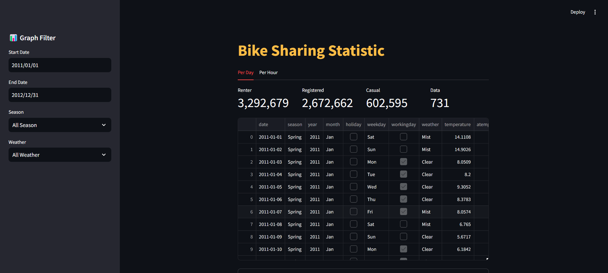

# Bike-Sharing-Analysis ✨



```
projek-data-analys/
├── dashboard/
│   ├── dashboard.py
│   ├── main_day_df.csv
│   ├── main_hour_df.csv
├── data/
│   ├── day_df.csv
│   ├── hour_df.csv
├── notebook.ipynb
├── README.md
├── requirements.txt
└── url.txt
```

## Clone Repository
```
git clone https://github.com/aryaulyakrisna/Bike-Sharing-Analysis.git
```

## Setup Environment & Installing Packages
```
python -m venv venv
venv/Scripts/activate
pip install -r requirements.txt
```

## Run steamlit app
```
streamlit run dashboard.py
```

## Go to Streamlit [🔗](https://aryaulyakrisna-bikeanalysis.streamlit.app/)
```
https://aryaulyakrisna-bikeanalysis.streamlit.app/
```
